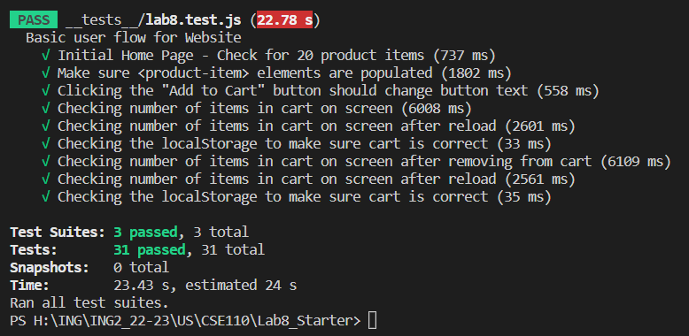
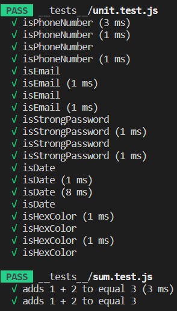

# Lab 8 - Starter

## Questions

1. Where would you fit your automated tests in your Recipe project development pipeline? Select one of the following and explain why.

    A. Within a Github action that runs whenever code is pushed 
    B. Manually run them locally before pushing code
    C. Run them all after all development is completed

Answer: A, because it provides the benefits of early issue detection and faster feedback, ensuring the quality and stability of the software application throughout the development process.

2. Would you use an end to end test to check if a function is returning the correct output? (yes/no)

Answer: No, an end-to-end test is not typically used to check if a function is returning the correct output. End-to-end tests are designed to simulate real user interactions and verify that the system as a whole functions correctly.

3. Would you use a unit test to test the “message” feature of a messaging application? Why or why not? For this question, assume the “message” feature allows a user to write and send a message to another user.

Answer: Yes, unit tests can be used to test the "message" feature of a messaging application. In the case of the "message" feature, there are likely specific functions or methods responsible for handling message composition, sending, receiving, and other related operations.

4. Would you use a unit test to test the “max message length” feature of a messaging application? Why or why not? For this question, assume the “max message length” feature prevents the user from typing more than 80 characters.

Answer: Yes, a unit test would be appropriate to test the "max message length" feature of a messaging application. It allows for focused testing of the specific code responsible for enforcing the character limit, ensuring that it correctly restricts messages exceeding 80 characters. Unit tests provide quick feedback, documentation of expected behavior, and help prevent regression issues in the future.

